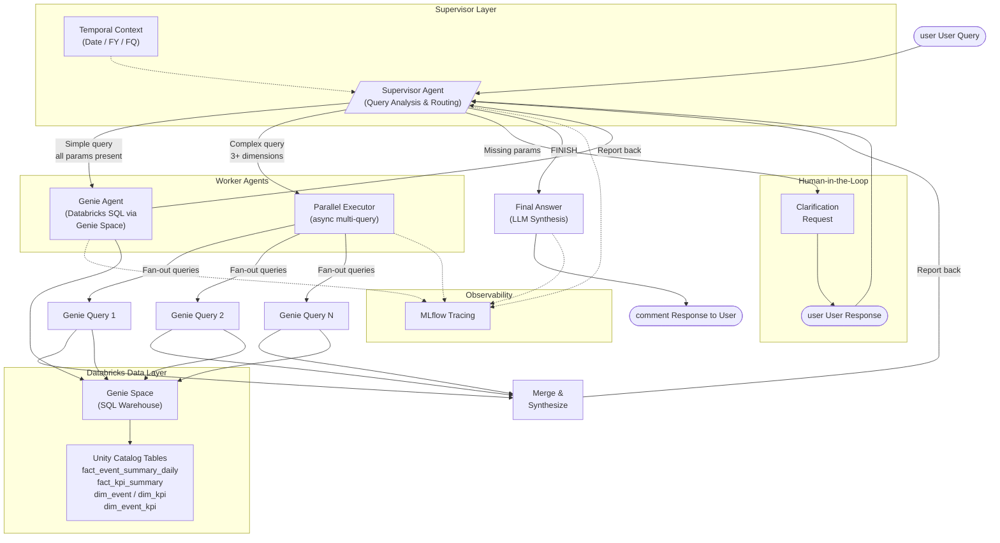

# Genie Deep Research Agent

A multi-agent system built on **LangGraph** and **Databricks** that performs deep analytical research over digital customer journey data. It combines a Databricks Genie data agent with an intelligent supervisor and parallel query execution to answer complex, multi-dimensional analytics questions conversationally.

## Architecture



## How It Works

The agent follows a **supervisor-worker** pattern orchestrated as a LangGraph state machine. Every user query flows through the same lifecycle:

1. **Supervisor receives the query** -- enriches the system prompt with live temporal context (today's date, fiscal year/quarter) and analyzes the request.
2. **Completeness check** -- the supervisor validates that all required parameters (date, stage, product, platform, etc.) are present. If anything is missing, it enters the Human-in-the-Loop flow to ask for clarification before proceeding.
3. **Routing decision** -- complete queries are routed to one of two worker agents:
   - **Genie Agent** for straightforward, single-metric lookups.
   - **Parallel Executor** for complex analyses that require 3+ independent data queries (e.g., cross-product or cross-platform comparisons).
4. **Workers report back** -- after execution, results are returned to the supervisor, which may iterate (up to a configurable max) or finalize.
5. **Final answer synthesis** -- the LLM generates a structured, user-facing response with formatted numbers, tables, and actionable recommendations.

### Key Capabilities

| Capability | Description |
|---|---|
| **Parallel Research** | Breaks complex questions into multiple sub-queries, executes them concurrently via `asyncio.gather`, and synthesizes a unified answer. |
| **Human-in-the-Loop (HITL)** | Detects incomplete queries, asks targeted clarification questions, and seamlessly merges the user's response with the original question. |
| **Conversation Memory** | Uses LangGraph's `MemorySaver` checkpointer with thread-based sessions so follow-up questions retain full context. |
| **Temporal Awareness** | Automatically resolves relative dates ("yesterday", "last week") against the current date and fiscal calendar. |
| **MLflow Tracing** | Every agent node, routing decision, and Genie query is traced end-to-end for observability and debugging. |
| **Graceful Error Handling** | Each node catches exceptions independently so a single sub-query failure doesn't crash the entire pipeline. |

## Data Domain

The agent operates over a digital customer journey analytics dataset in Databricks Unity Catalog:

| Table | Purpose |
|---|---|
| `fact_event_summary_daily` | Event counts and distinct users by date, platform, and app version |
| `fact_kpi_summary` | KPI success/failure counts by date and hour |
| `dim_event` | Journey stage definitions (awareness, interest, consideration, conversion, intent) |
| `dim_event_kpi` | Mappings between events and KPIs |
| `dim_kpi` | KPI definitions across systems |

Products covered include Personal Loans, Business Loans, Home Loans, Gold Loans, and specialized loan variants across Android, iOS, and Web platforms.

## Tech Stack

- **LangGraph** -- state-machine orchestration for the multi-agent workflow
- **Databricks Genie** (`databricks-langchain`) -- natural-language-to-SQL data agent backed by a Genie Space
- **Claude 3.7 Sonnet** (via `ChatDatabricks`) -- LLM for supervisor routing and final answer synthesis
- **MLflow** -- experiment tracking, model serving, and distributed tracing
- **Databricks Asset Bundles** -- deployment and environment management
- **Pydantic** -- structured output schemas for routing decisions and research plans

## Project Structure

```
Genie_DeepResearch/
├── Genie_deepresearch.ipynb   # Main notebook: agent definition, graph wiring, execution
├── configs.yaml               # All agent prompts, model settings, and data configs
├── databricks.yml             # Databricks Asset Bundle deployment descriptor
├── requirements.txt           # Python dependencies
└── .env                       # Environment variables (not committed)
```

## Setup

### Prerequisites

- Python 3.10+
- A Databricks workspace with a configured Genie Space and SQL Warehouse
- Access to the `databricks-claude-3-7-sonnet` model serving endpoint

### Installation

```bash
pip install -r requirements.txt
```

### Environment Variables

Create a `.env` file with:

```
DB_MODEL_SERVING_HOST_URL=<your-databricks-workspace-url>
DATABRICKS_GENIE_PAT=<your-databricks-personal-access-token>
```

### Configuration

All agent behavior is controlled through `configs.yaml`:

- **`databricks_configs`** -- catalog, schema, warehouse, and workspace connection details
- **`agent_configs.llm`** -- model endpoint and temperature
- **`agent_configs.genie_agent`** -- Genie Space ID and data description
- **`agent_configs.supervisor_agent`** -- system prompt, research planning prompt, HITL workflow rules, and iteration limits

### Running

Open `Genie_deepresearch.ipynb` in Databricks or locally and execute the cells sequentially. The notebook:

1. Installs dependencies and initializes the Databricks client
2. Constructs the Genie agent, supervisor, and parallel executor
3. Wires them into a LangGraph state machine
4. Wraps the graph in an MLflow `ChatAgent` for serving
5. Runs sample queries to validate the pipeline

### Deployment

The project uses Databricks Asset Bundles. Deploy with:

```bash
databricks bundle deploy --target dev
```

## Example Queries

```text
# Simple lookup (routed to Genie)
"What are the lead counts for stage 4 on December 6th?"

# Complex parallel analysis (routed to ParallelExecutor)
"Compare metrics between Android versions P.26.0.0 vs P.13.3.0:
 user engagement, conversion rates, KPI success rates, and feature adoption."

# Triggers HITL clarification
"What are the lead counts for stage 4?"
→ Agent asks: "Which date would you like to analyze?"
→ User: "December 4th"
→ Agent combines and routes the complete query
```
